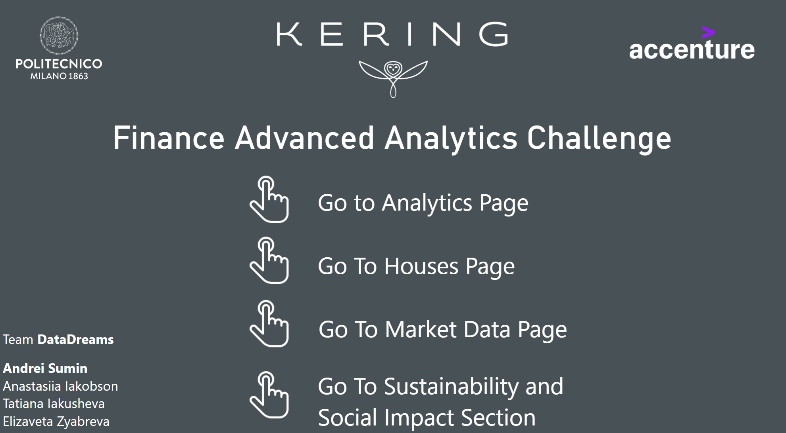
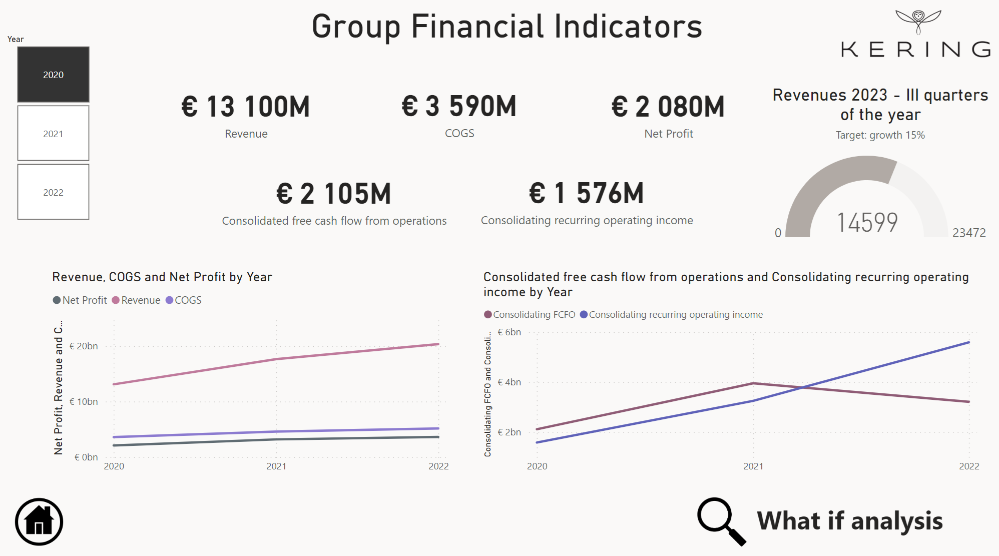
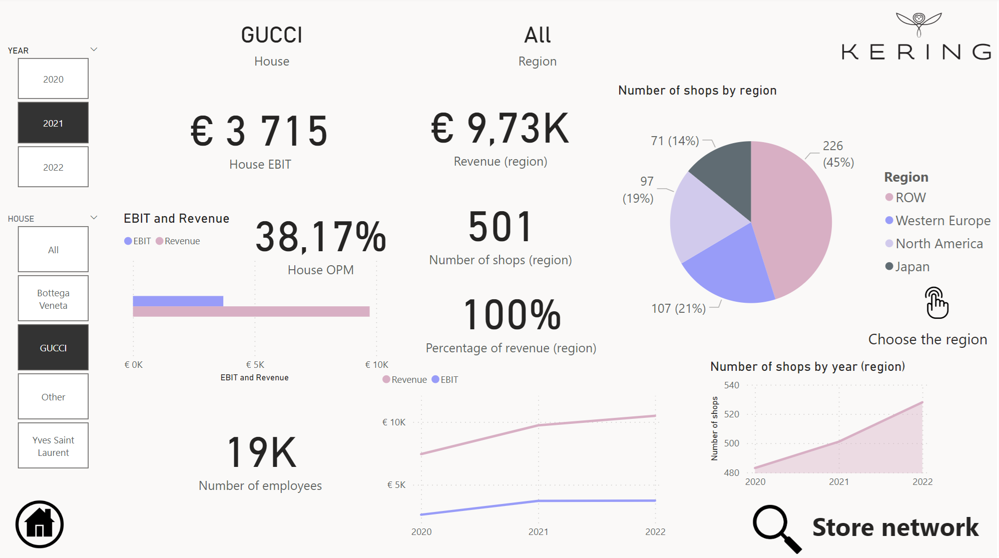
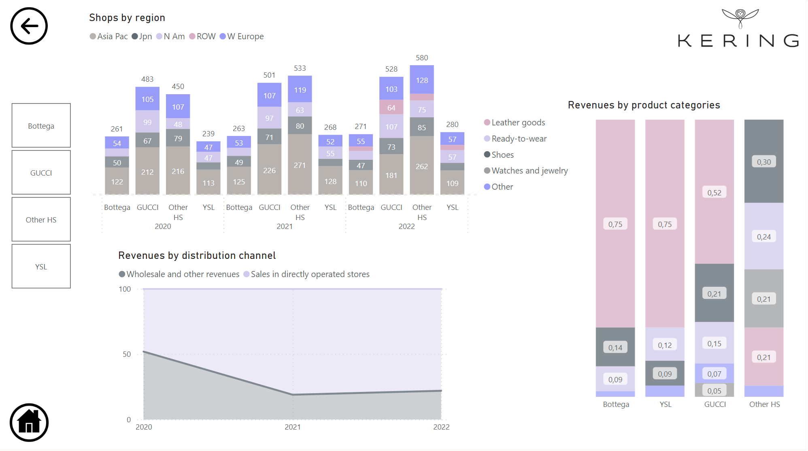
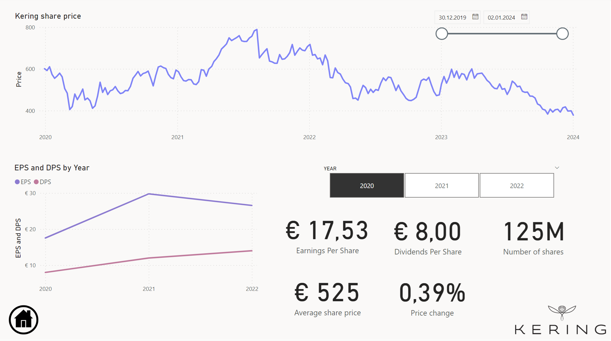
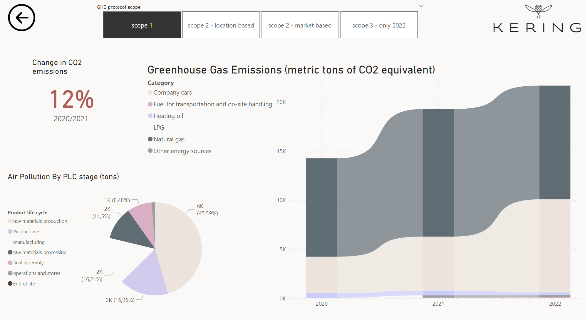
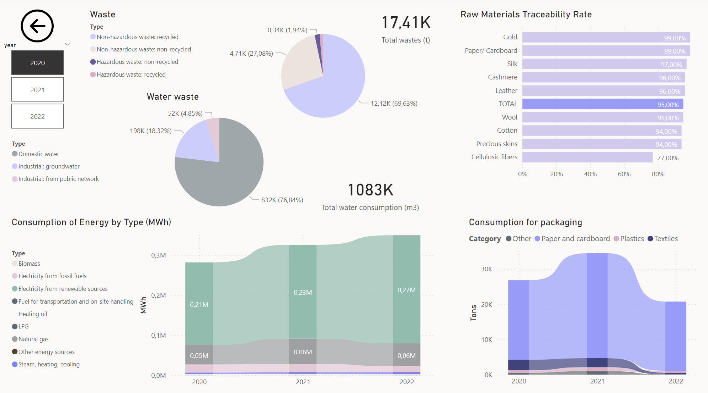

# Accenture Finance Advanced Analytics Challenge
This project is a **winner** of the challenge.

## Overview
The focus of this project is an analysis of the **Kering Group**, leveraging publicly available reports to gain insights into the company's performance. The primary objective was to develop a comprehensive dashboard that investigates both **financial** and **non-financial KPIs**, providing a holistic view of the company’s performance and facilitating data-driven decision-making.

Our unique approach emphasized evaluating the **criteria for executive bonuses**, as these align closely with the company’s overall strategic direction. By focusing on this area, the dashboard is tailored to support executives in making informed decisions.

## Key Features
The dashboard is divided into several sections, providing a comprehensive analysis of the Kering Group:

1. **Analytics Overview**
   - Summarizes key financial metrics.
   - Includes visualizations of revenue and profitability trends over multiple years.

2. **What-If Analysis**
   - Simulates potential scenarios, such as changes in COGS or revenue growth.
   - Provides insights into the impact of these changes on profitability and other key metrics.

3. **Houses Page**
   - Breaks down the performance of individual brands under the Kering umbrella.
   - Displays metrics by house, year, and region.

4. **Store Network**
   - Maps the geographical distribution of Kering’s stores and revenue by region.
   - Tracks store counts, sales channels, and revenue by product category.

5. **Market Data Page**
   - Analyzes Kering’s stock performance in detail.
   - Tracks earnings per share (EPS), dividends per share (DPS), and price trends over time.

6. **Sustainability and Social Impact**
   - Highlights Kering’s efforts in reducing emissions, managing environmental risks, and promoting gender equality.
   - Includes metrics such as waste management, energy consumption, and board diversity.

## Dashboard Preview

### 1. Home Page

### 2. Analytics Page
Switch between years to explore changes in key metrics.

### 3. What-If Analysis
Simulate the outcomes of changes in COGS or revenue growth.

### 4. Houses Page
Switch between years and individual houses to analyze their performance.

### 5. Store Network
Explore the geographical distribution of stores and revenue. Switch between houses for further insights.

### 6. Market Data Page
View detailed stock performance. Switch between years to track trends.

### 7. Sustainability and Social Impact Home

### 8. Emissions
Explore emissions data, switching between scopes for detailed analysis.

### 9. Environmental Metrics
Switch between years to explore trends in environmental metrics.

### 10. Gender Equality
View gender diversity metrics and initiatives.

## Tools and Technologies
- **Power BI**: Used to create the interactive dashboard and visualizations.
- **Excel**: Used for data preprocessing and storage.
- **Public Reports**: Data was sourced from publicly available annual and sustainability reports.

## Files in the Repository
- `Dashboard.pbix`: A Microsoft Power BI dashboard file containing the interactive dashboard.
- `Data.xlsx`: An Excel workbook containing the data used for dashboard creation.
- `screenshots/`: A folder with screenshots of all the dashboard pages.

## How to Access the Dashboard
1. Download the `Dashboard.pbix` file from this repository.
2. Open the file using Microsoft Power BI Desktop.

  
 

### License:
This project is licensed under the MIT License. See the [LICENSE](./LICENSE) file for details.
