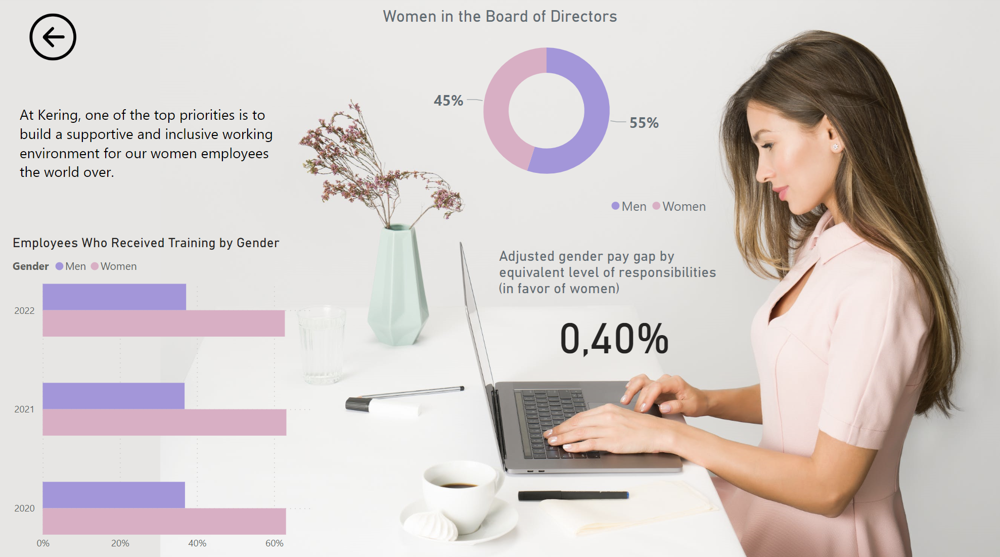

# Accenture Finance Advanced Analytics Challenge
This prject is a **winner** of the challenge.

## Overview
The focus of this project is an analysis of the **Kering Group**, leveraging publicly available reports to gain insights about company's performance. The primary objective was to develop a comprehensive dashboard that investigates both financial and non-financial KPIs providing a holistic view of the performance and facilitating data-driven decision-making. 

Our unique approach emphasized evaluating the **criteria for executive bonuses**, as these align closely with the company’s overall strategic direction. By focusing on this area, the dashboard is tailored to support executives in making informed decisions.

## Key Features
The dashboard is divided into several sections, providing a comprehensive analysis of the Kering Group:
1. **Analytics Overview**
   - Summarizes key financial metrics.
   - Includes visualizations of revenue and profitability trends over multiple years.
  
2. **What-If Analysis**
   - Enables simulation of potential scenarios, such as changes in COGS or revenue growth.
   - Provides insights into the impact of these changes on profitability and other key metrics.

3. **Houses Page**
   - Breaks down the performance of individual brands under the Kering umbrella.
   - Displays metrics by house, year and region.
     
4. **Store Network**
   - Maps the geographical distribution of Kering’s stores and revenue by region.
   - Tracks store counts, sales channels, and revenue by product category.

5. **Market Data Page**
   - Presents a detailed analysis of Kering’s stock performance.
   - Tracks earnings per share (EPS), dividends per share (DPS), and price trends over time.

6. **Sustainability and Social Impact**
   - Highlights Kering’s efforts in reducing emissions, managing environmental risks, and promoting gender equality.
   - Includes metrics such as waste management, energy consumption, and board diversity.

## Dashboard Preview

### 1. Home Page

### 2. Analytics Page
Allows to switch between years.

### 3. What-If Analysis
Allows to simulate outcomes of changes in COGS or revenue growth.

### 4. Houses Page
Allows to switch between years and houses.

### 5. Store Network
Allows to switch between houses.

### 6. Market Data Page
Allows to switch between years.

### 7. Sustainability and Social Impact Home

### 8. Emissions
Allows to switch between scopes.

### 9. Environmental Metrics
Allows to switch between years.

### 10. Gender Equality

## Tools and Technologies
- **Power BI**: To create the interactive dashboard and visualizations.
- **Public Reports**: Data was sourced from publicly available annual and sustainability reports.
- **Excel**: For data preprocessing and storage.
